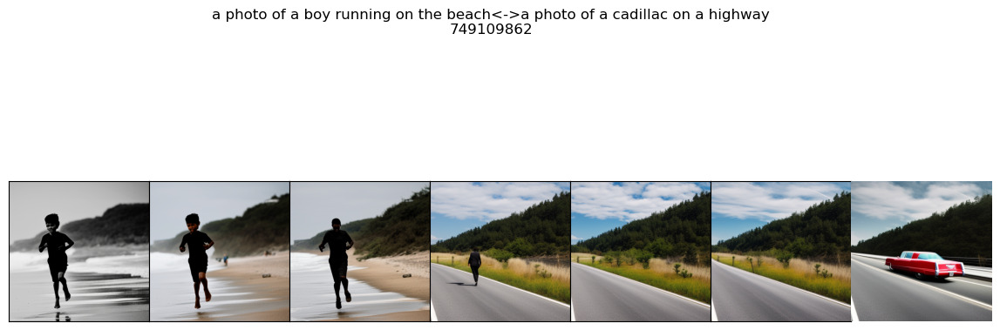
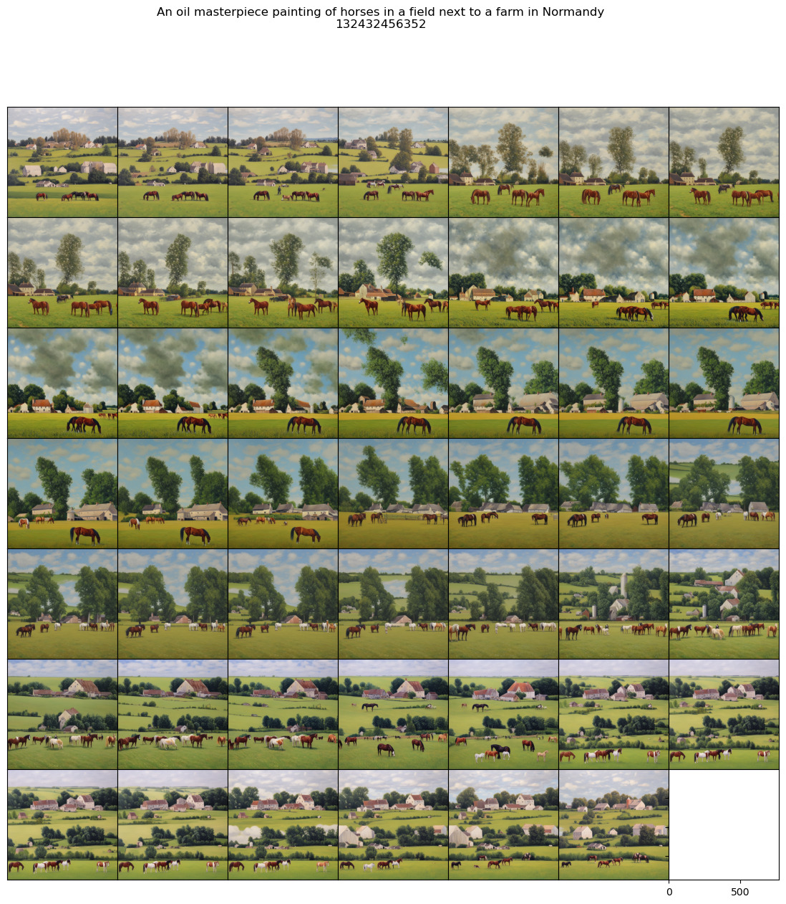

# sd_explorer
Exploration of [Stable Diffusion](https://github.com/Stability-AI/StableDiffusion) spaces (prompt embedding and diffusion noise spaces) via [pytorch](https://pytorch.org/), python code and examples.

By [Giuseppe Insana](https://insana.net), December 2022

## Requirements
torch, transfomers, diffusers, safetensors, PIL, matplotlib

## Usage
Clone the repository and run the provided jupyter notebook.

## Tutorial
Code and usage examples are all in the provided [jupyter notebook](sd_explorer.ipynb).
All the main functions have documentation on their usage and arguments.

Note: if the version on github is not rendering properly, try [this one, via nbviewer.jupyter.org](https://nbviewer.jupyter.org/github/g-insana/sd_explorer/blob/main/sd_explorer.ipynb#Examples) to preview the notebook before you run it on your environment. Tip: jump to usage examples

## Examples and main functionalities
* Simple text2img and repeated sampling
```prompt2img([prompt1, prompt2], seed=seed, n_samples=3)```
* Interpolation between text prompts ```interpolate_prompts([prompt1, prompt2], interpolate_steps=5)```

* Walking in embedding space beyond the correct point produced by a prompt ```images = beyond_prompt(prompt, walk_steps=8, walk_stepsize=0.01)```

* Circular or spiral spherical walks through the diffusion noise space with 2 or 3 seeds ```revolve_prompt(prompt, walk_steps=walk_steps, seed=seed, seed2=seed2)```

Click to play 


* Multiple variations over a prompt ```prompt_variations(prompt, variations=8)```
* Gradual interpolation between variations ```variate_prompt(prompt=prompt, seed=seed, seed2=seed2, var_steps=6)```

## Inspiration
[A walk through latent space with Stable Diffusion](https://keras.io/examples/generative/random_walks_with_stable_diffusion/)


